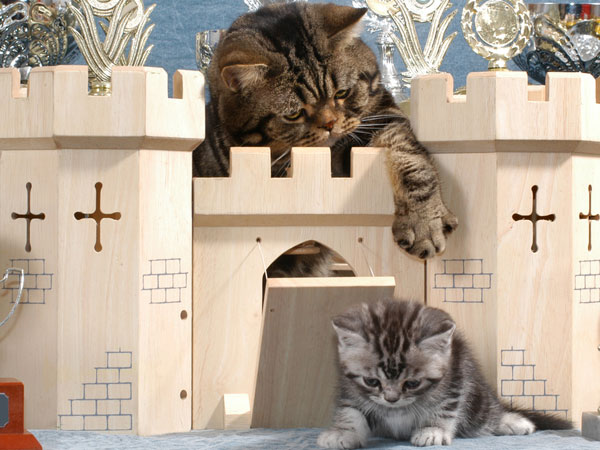
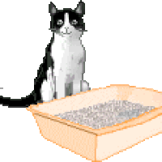

Pet + Cattle = Catello
======================

Have you ever thought to yourself, "hmmm, this system administration stuff is too easy." Enter Catello.

Here is a developer hard at work building Catello:
=======================

Here is one of our users using Catello:
=======================

Why we made Catello:
=======================

What Catello can do for you:
=======================

How we fix bugs in Catello:
===========================

How to add a feature to Catello:
============================

Catello wouldn't be possible without 4MAN:
============================

Catello should be run multi-threaded
====================================

Catello is backed by candlepin that our users love:
============================

A word of warning:
==================

Please use [catlift](https://github.com/Catello/catlift) instead.

How to measure your Catello usage:
=================================

Steps
-----

1. Install catello
2. ???
3. Profit!

